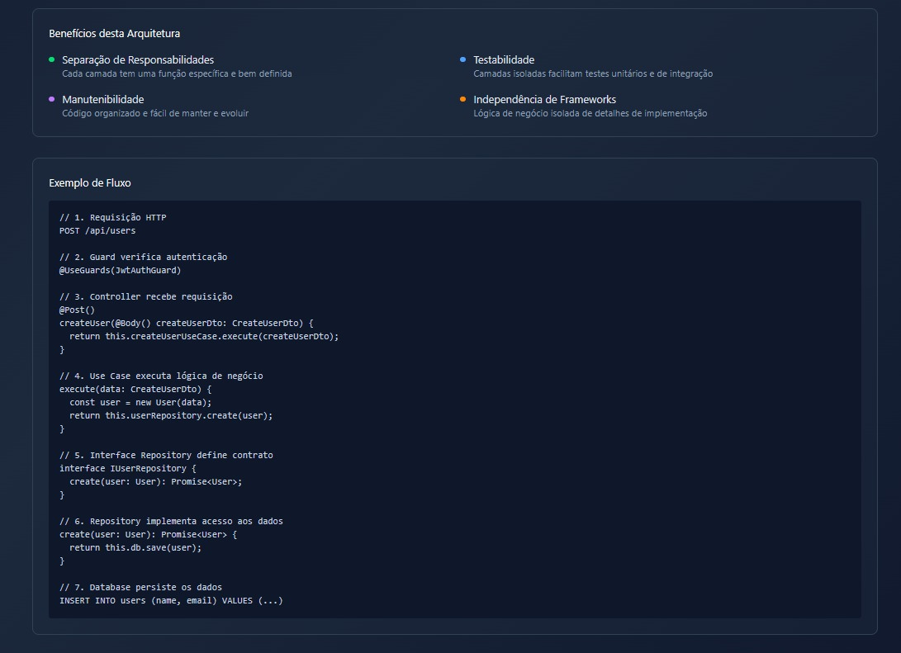

# README.md

# Aplicação NestJS com Docker

Este projeto é uma aplicação **NestJS** pronta para rodar com **Docker**, permitindo um setup rápido sem precisar instalar Node.js ou bancos de dados localmente.

---

## Pré-requisitos

Antes de começar, você precisa ter instalado:

* [Docker](https://www.docker.com/get-started)
* [Docker Compose](https://docs.docker.com/compose/install/)

## Rodando com Docker

### 1️⃣ Criar a rede interna (subnet)

Para isolar os containers e permitir comunicação interna, criamos uma rede Docker chamada `internal_network`:

```bash
docker network create --driver bridge internal_network
```

### 2️⃣ Build e start dos containers

```bash
docker-compose up -d
```

### rodar as migrations

```bash
docker-compose exec app npx typeorm-ts-node-commonjs migration:run -d src/infrastructure/database/config/database.config.ts
```
### rodar os testes

```bash
docker-compose exec app npm run test
```

obs : caso aconteça o seguinte erro ao rodar os testes pela primeira vez, rode novamente o comando -> docker-compose exec app run npm test

```bash
[napi-postinstall@0.3.4] Trying to install package "@unrs/resolver-binding-linux-x64-musl" using npm
● Validation Error:

  Module ts-jest in the transform option was not found.
         <rootDir> is: /usr/src/app/src

  Configuration Documentation:
  https://jestjs.io/docs/configuration
```

### 3️⃣ Acessando a aplicação

* A aplicação ficará disponível em: `http://localhost:3000`
* Se você estiver usando Swagger, geralmente em: `http://localhost:3000/api/swagger`

---

### Comandos úteis

* **Parar containers**:

```bash
docker-compose down
```

* **Rodar em modo detach (background)**:

```bash
docker-compose up -d
```

* **Ver logs da aplicação**:

```bash
docker-compose logs -f
```

* **Rebuild da imagem** (quando alterar dependências):

```bash
docker-compose build --no-cache
```

## Observações

* Certifique-se de que as portas definidas no `.env` e `docker-compose.yml` não estejam em conflito com outros serviços.

## Diagrama de Arquitetura:




## Escalabiilidade:

Multi-Tenant
* Por schema: cada cliente com seu próprio schema

* Por coluna: identificação do tenant em cada registro

* Ideal para aplicações SaaS com múltiplos clientes isolados.

Cache com Redis

* Armazena URLs encurtadas e aliases

* Reduz consultas ao banco

* Suporta alta concorrência com baixa latência

Observabilidade
* Datadog: métricas, logs e rastreamento distribuído

* Grafana + Prometheus: dashboards e alertas

Métricas recomendadas:

* Requisições por segundo

* Tempo de resposta da API

* Erros por endpoint

* Uso de CPU/RAM por container
